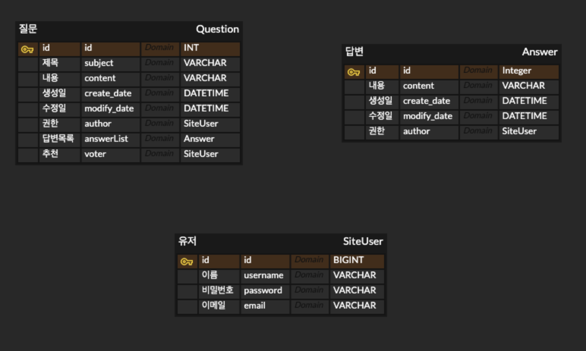
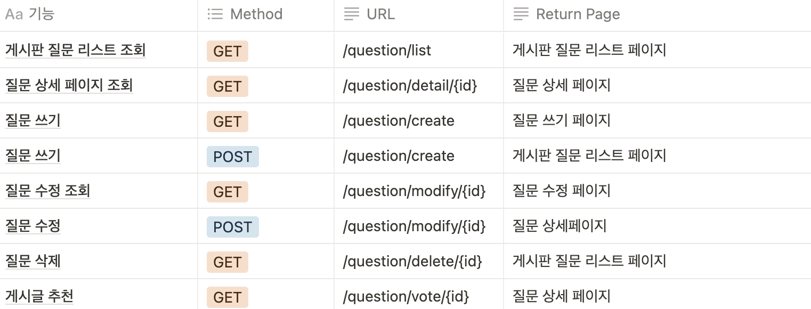
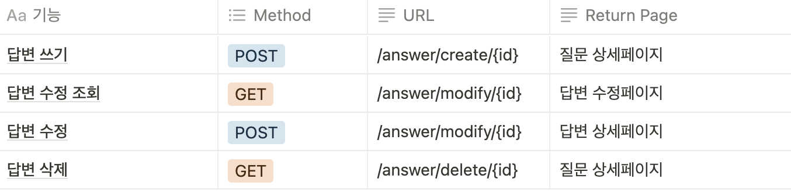
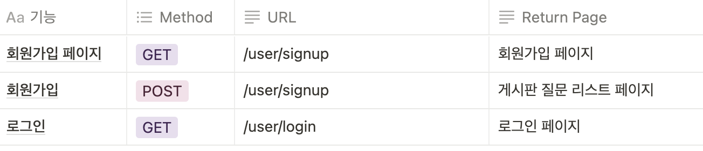

# Spring Boot Board Project
> 게시판 만들기 두번째 프로젝트!

## 목차
- 들어가며
    - 프로젝트 소개
    - 프로젝트 기능
    - 사용기술
        - 백엔드
        - 프론트엔드

- 구조 및 설계
    - DB 설계
    - API 설계

- 마치며
    - 보완사항
    - 후기

## 들어가며
### 1. 프로젝트소개
JAVA를 기반으로 질문/답변 형식의 게시판을 만들었습니다.  
Bootstrap과 thymeleaf를 사용해서 프론트를 간단히 제작.
### 2. 프로젝트 기능
**게시판:** 질문/답변 CRUD, 추천 기능  
**사용자:** Spring Security, 작성자만 수정/삭제 가능

### 3. 사용기술
#### 백엔드
- JAVA11, SpringBoot, JPA(Spring Data JPA), Spring Security, Gradle
#### 프론트엔드
- Html/Css, Javascript, Bootstrap, thymeleaf

### 4. 구조 및 설계
  

    
DB 설계

  

   
  

  
API 설계

#### - 질문API

#### - 답변API

#### - 유저API

  

### 5. 마치며
- #### 보완사항
    1. 메뉴 카테고리(자유게시판 등등)
    2. 비밀번호 찾기/변경
    3. 답변 페이징/정렬(sorting기능)
    4. 댓글
    5. 소셜 로그인

회고  
두번째 본격적인 spring boot로 만드는 board 프로젝트이다.  
이번에는 책을 통해 만들어나가서 spring boot, thymeleaf의 구조를 더 잘 알아가며 프로젝트를 진행 할 수 있었다.  
첫번째 sbb프로젝트보다 spring boot를 구조적으로 제대로 알 수 있어서 훨씬 배움이 많이 되었다.  
또한, 기존에 했던 방식들과 다른 구조로 만들어서 재미있게 만들 수 있었다.  
1. 저번과 다르게 이번에는 코드를 모두 쳤으며, 조금 이상하다고 생각한 방식은 조금씩 수정하며 진행해서 이전보다 더 재미있게 프로젝트를 만들 수 있었다.  
2. 이상하게도 완성된 코드 기반을 가지고 하는데, 너무 많은 에러를 만나고 수정하는데 시간을 많이 쏟았다. 그래서 나에게 더 의미있는 프로젝트였던거 같다.
3. 지금도 많은 에러가 존재할 수 있고(어디서 나올지 모를 일이니...), 추가하고 싶은 기능들도 참 많다. 앞으로 더 클린한  코드로 추가해가면 좋겠다.